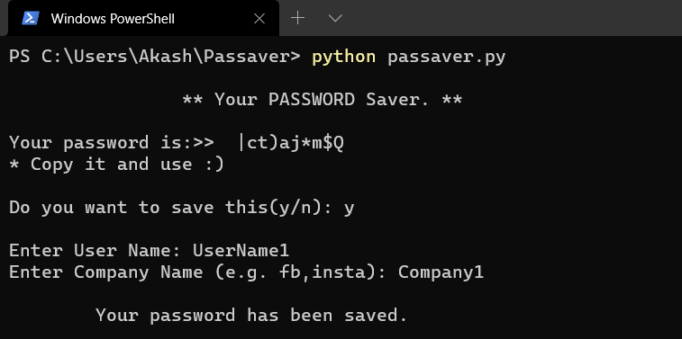
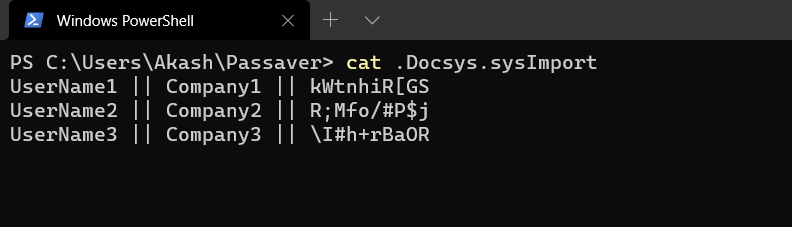

# Passaver

## Feature :
* Auto Generate random strong passwords
* Save with UserName , Company name (FB,Insta,linkedin etc..) and with the password
* Customize password_lenght (default is 10 character)
* Password, username and all credentials are saved in `.Docsys.sysImport` named file in same directory.
* Easy to use 

## Installation :
* Install Python 3
* Clone the git repository:
`git clone https://github.com/akashisgreat/Passaver` 
`cd Passaver`

## Run :
In Passaver directy
* `python passaver.py` 
* `python3 passaver.py` # If both python3 and python installed.

Output like this: 

 

## Usage:  
To see all credentials, open `.Docsys.sysImport` with any TextEditor 

### Data Structure : 
* Format: `UserName || CompanyName || {Password}` 
* Data are separated with Two vertical bars " || "
